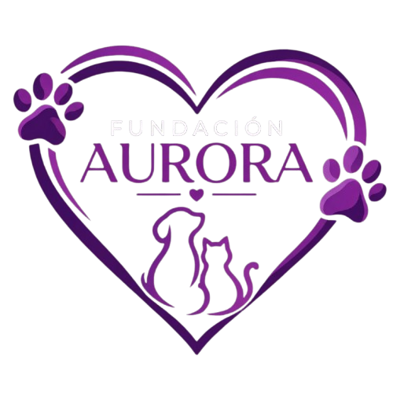

# 🐾 Fundación Aurora - Plataforma Web de Adopción de Mascotas

  

¡Bienvenidos al repositorio oficial de la **Fundación Aurora**!

> 📢 **Nota de desarrollo:** Este proyecto utiliza el flujo de trabajo de GitFlow. El desarrollo activo de nuevas funcionalidades, Sprints y documentación se encuentra en la rama **`develop`**.

> 🎓 **Nota académica:** Este es un **proyecto ficticio** desarrollado con fines exclusivamente académicos para la asignatura **Proyecto de Software**. La "Fundación Aurora" es un escenario simulado para aplicar buenas prácticas de ingeniería de software.

Nuestro objetivo es simular y construir una plataforma web real que ayudaría a una fundación de animales a gestionar sus mascotas rescatadas y facilitar el proceso de adopción responsable.

---

## 👥 Equipo de Trabajo

* **Angélica Sáenz** — *Estudiante de Ingeniería de Software*
* **Paula Cabrera** — *Estudiante de Ingeniería de Software*

---

## 📌 ¿De qué trata el proyecto?

El sistema permitirá:
1. **Mostrar un catálogo interactivo** donde las personas puedan ver las mascotas disponibles para adoptar (perros, gatos, etc.) organizadas por secciones con sus fotos y descripción.
2. **Enviar solicitudes de adopción** a través de un formulario web sencillo.
3. **Administrar la fundación** mediante un panel privado donde se puedan registrar nuevas mascotas, gestionar catálogos y evaluar las solicitudes recibidas.

---

## 🎯 Gestión del Proyecto (Metodología Scrum)

El seguimiento de los Sprints, las Historias de Usuario, el Product Backlog y la planificación del equipo se gestionan bajo el marco de trabajo **Scrum** a través de Trello:

* 📌 **Tablero de Scrum en Trello:** [Ver Tablero de Seguimiento - Fundación Aurora](https://trello.com/invite/b/6aa4a6320fea3ba01ca637f5/ATTIf3e7a32e8fba286057213e70211c5837F34330A7/fundacion-aurora-scrum)

---

## 📚 Documentación Técnica del Sistema

Para consultar las especificaciones detalladas del sistema, puedes navegar directamente a la documentación ubicada en la carpeta `docs/`:

* 📋 [Requisitos del Sistema y Formulación](docs/requisitos.md)
* 🏗️ [Estructura del Proyecto y Capas](docs/estructura-proyecto.md)
* 📐 [Diagrama de Clases UML](docs/diagrama-de-clases.md)
* 📝 [Historias de Usuario](docs/historias-de-usuario.md)

---

## 👭 Plan de Trabajo (16 Semanas / 8 Sprints)

Organizaremos el proyecto en **16 semanas**, divididas en 4 etapas principales ejecutadas mediante Sprints de Scrum:

- **Etapa 1: Análisis y Diseño (Semanas 1 a 4 / Sprints 1 y 2)**
    - Levantamiento de requisitos funcionales y no funcionales.
    - Creación y refinamiento de Historias de Usuario para el Product Backlog.
    - Elaboración del Diagrama de Clases y diseño del esquema de Base de Datos.
    - Estructuración de la documentación técnica inicial.

- **Etapa 2: Desarrollo Backend (Semanas 5 a 8 / Sprints 3 y 4)**
    - Creación de la arquitectura base en Spring Boot.
    - Persistencia de datos con PostgreSQL y Spring Data JPA.
    - Construcción de los endpoints (API REST) para entidades, servicios y controladores.

- **Etapa 3: Desarrollo Frontend (Semanas 9 a 12 / Sprints 5 y 6)**
    - Creación de la interfaz de usuario con React y Vite.
    - Implementación del catálogo público interactivo.
    - Formulario de adopción y vistas para el panel de administración.

- **Etapa 4: Integración, Pruebas y Despliegue (Semanas 13 a 16 / Sprints 7 y 8)**
    - Integración cliente-servidor mediante consumo de API REST.
    - Pruebas funcionales del sistema.
    - Despliegue en servicios cloud (Vercel / Render / Supabase) para el portafolio.

---

## 🛠️ Tecnologías Utilizadas

- **Frontend:** React + Vite
- **Backend:** Java + Spring Boot (Spring Data JPA)
- **Base de Datos:** PostgreSQL
- **Control de Versiones y Metodología:** Git/GitHub (Rama activa `develop`) y Scrum (Trello)