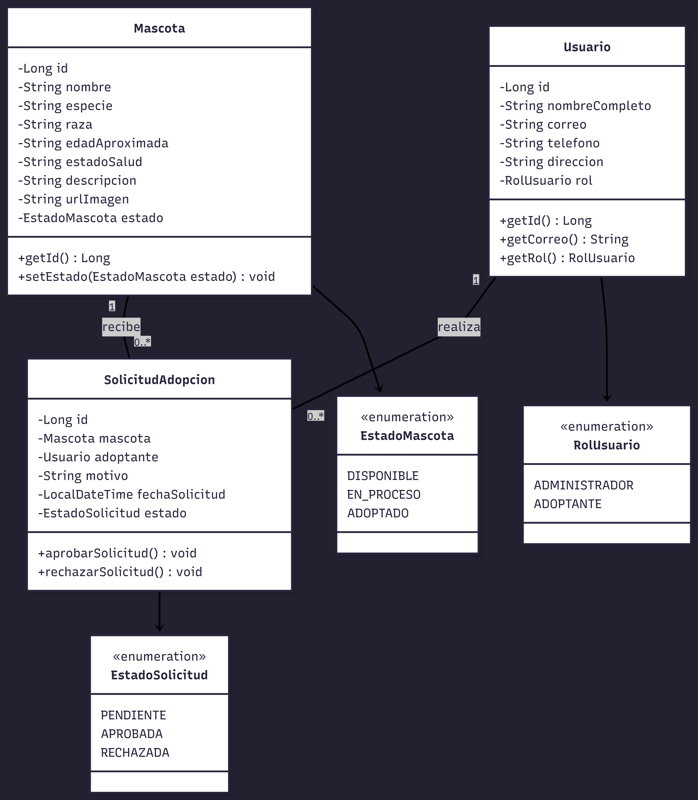

# 📐 Diagrama de Clases UML - Fundación Aurora

Este documento contiene el Diagrama de Clases orientadas a objetos para el backend en **Spring Boot**, representando el modelo de dominio del sistema.

---

## 🎨 Diagrama UML

---

## 📌 Explicación del Modelo de Clases

1. **`Mascota`**: Representa la entidad de dominio para los animales rescatados. Posee una relación de enumeración con `EstadoMascota`.
2. **`Usuario`**: Representa a las personas registradas en el sistema (Adoptantes o Administradores) mediante la enumeración `RolUsuario`.
3. **`SolicitudAdopcion`**: Clase intermedia que gestiona la lógica de postulación, vinculando un `Usuario` adoptante con una `Mascota` específica.
4. **Relaciones**:
    * Una `Mascota` puede recibir de 0 a muchas (`0..*`) solicitudes.
    * Un `Usuario` puede realizar de 0 a muchas (`0..*`) solicitudes.