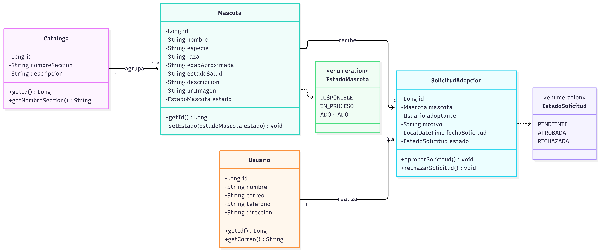

# 📐 Diagrama de Clases UML - Fundación Aurora

Este documento contiene el Diagrama de Clases orientadas a objetos para el backend en **Spring Boot**, representando el modelo de dominio del sistema.

---

## 🎨 Diagrama UML

---

## 📌 Explicación del Modelo de Clases

1. **`Mascota`**: Representa la entidad de dominio para los animales rescatados.
    * **Atributos:** `id` (Long), `nombre` (String), `especie` (String), `raza` (String), `edadAproximada` (String), `estadoSalud` (String), `descripcion` (String), `urlImagen` (String) y `estado` (EstadoMascota).

2. **`Catalogo`**: Representa las secciones o agrupaciones organizadas dentro del sistema para clasificar las mascotas disponibles.
    * **Atributos:** `id` (Long), `nombreSeccion` (String), `descripcion` (String) y `mascotas` (List de Mascota).

3. **`Usuario`**: Representa a las personas registradas dentro de la plataforma.
    * **Atributos:** `id` (Long), `nombre` (String), `correo` (String), `telefono` (String) y `direccion` (String).

4. **`SolicitudAdopcion`**: Clase que gestiona el proceso de postulación, vinculando la información del solicitante con la mascota deseada.
    * **Atributos:** `id` (Long), `mascota` (Mascota), `adoptante` (Usuario), `motivo` (String), `fechaSolicitud` (LocalDateTime) y `estado` (EstadoSolicitud).

---

## 🔗 Relaciones del Sistema

* Un **`Catalogo`** contiene de 1 a muchas (`1..*`) **`Mascotas`**.
* Una **`Mascota`** pertenece a 1 **`Catalogo`** y puede recibir de 0 a muchas (`0..*`) **`SolicitudesAdopcion`**.
* Un **`Usuario`** puede realizar de 0 a muchas (`0..*`) **`SolicitudesAdopcion`**.